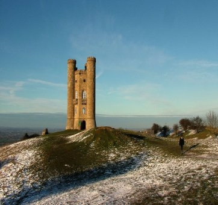
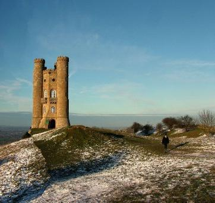
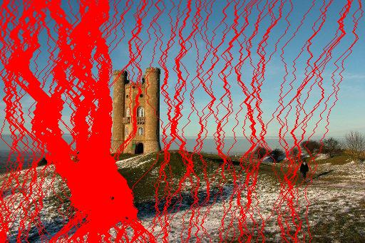
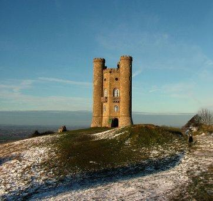

Seam Carving: Content-aware image resizing
==========================================
(This is a copy of my original `blog post`_ of 09/02/2007)

Most people most likely saw the YouTube movie on content-aware image resizing
which got blogged quite a lot lately. I read the corresponding paper, and wrote
an implementation (not finished/perfect at all, but well) in Python. If it
would ever become "production quality" a Gimp and/or GEGL plugin would be nice.

Here's a sample:

Resized using Gimp, cubic interpolation, 150px

Resized image, 150px

Overview of removed pixels

This transformation is done in about 2 seconds (mainly because of some
calculations in pure Python. For most calculations I use the Python Imaging
Library and SciPy/NumPy, which are mainly C modules and much faster). As you
can see the implementation still needs lots of love.

You can see another sample (image resized from 1000 to 250px in 8 seconds) here_.

Git repository is here. Please email any patches!

The algorithm itself is surprisingly "simple" and easy to understand, great job
by the researchers! More on that later. I should be studying mathematical
analysis now, 2nd time I got to redo this exam, bloody university :-(

Update:
Using very expensive algorithm

This image was generated by:

* Loading the input image
* 150 times:

  - Calculate energy and cost of current working picture
  - For every pixel in the top row, calculate the cost of the "best path"
    starting at this pixel
  - Figure out which path is the cheapest
  - Create an image which is the working image, minus this best path
  - Replace the working image with the image generated in the previous step

This took 273 seconds on my system, as the complexity is something like
O(150*N*N*N*N*N*N*M) where M is the complexity of the gradient magnitude
calculation.

Conclusion: not a workable solution :D

Do notice there are significant changes between this image and the one
posted above. As I wrote this as a quick hack, I didn't include code to show
which paths were removed from the original image.

.. _blog post: http://blog.eikke.com/index.php/ikke/2007/09/02/seam_carving_content_aware_image_resizin
.. _here: seam_carving_6.png
